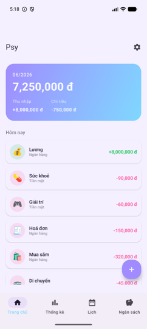
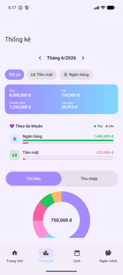
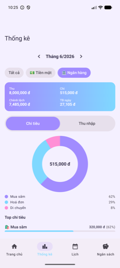
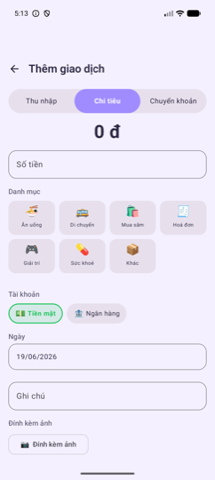
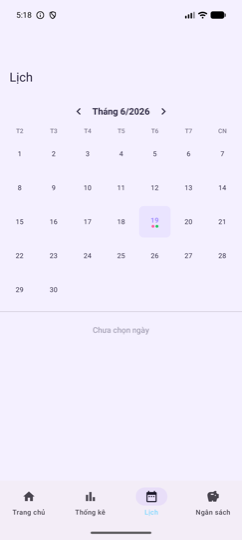
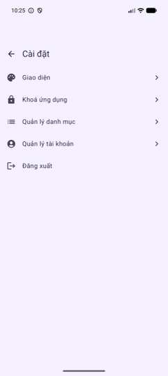

# Psy 🐷 — Money Tracker

Ứng dụng quản lý thu chi cá nhân **offline-first**, giao diện "Candy Pop" dễ thương, kèm backend Go để **đăng nhập Google + sao lưu / đồng bộ** đám mây.

> Android (Kotlin · Jetpack Compose) + Backend (Go · Postgres). Mã nguồn dùng riêng / chia sẻ người thân.

---

## ✨ Tính năng / Features

- **Ghi chép thu / chi / chuyển khoản** — offline-first, mở là dùng ngay, không cần mạng.
- **Nhiều tài khoản** (Tiền mặt, Ngân hàng + tự thêm) — và **so sánh thu/chi theo từng tài khoản** ngay trong màn Thống kê, bấm 1 tài khoản để lọc riêng (pie / xu hướng / top).
- **Thống kê**: donut chart theo danh mục, xu hướng 6 tháng, top chi tiêu / thu nhập, trung bình ngày.
- **Lịch**: xem giao dịch theo ngày, chấm màu thu/chi trên từng ngày.
- **Ngân sách**: đặt ngân sách tổng + theo danh mục, theo dõi vượt mức.
- **Cá nhân hoá**: nhiều theme, **khoá ứng dụng** bằng PIN / vân tay (biometric).
- **Đăng nhập Google** (bắt buộc khi mở app) + **tự động sao lưu / đồng bộ** sau mỗi phiên. Đổi tài khoản = đăng xuất trong Cài đặt.

## 📸 Screenshots

<table>
  <tr>
    <td align="center"><br><sub>Trang chủ</sub></td>
    <td align="center"><br><sub>Thống kê — so sánh theo tài khoản</sub></td>
    <td align="center"><br><sub>Lọc riêng 1 tài khoản</sub></td>
  </tr>
  <tr>
    <td align="center"><br><sub>Thêm giao dịch</sub></td>
    <td align="center"><br><sub>Lịch</sub></td>
    <td align="center"><br><sub>Cài đặt</sub></td>
  </tr>
</table>

## 🏗️ Kiến trúc / Architecture

```
psy/
├── android/     # App Android — Kotlin, Jetpack Compose (Material3)
├── backend/     # API — Go (chi) + Postgres
├── design/      # Source artwork (icon launcher)
└── docs/        # Spec, hướng dẫn chạy, screenshots
```

**Android** (`com.psy`)
- UI: Jetpack Compose + Material3, theme "Candy Pop".
- Pattern: MVVM, **Hilt** (DI), **Room** (DB cục bộ), DataStore (preferences), Navigation Compose.
- Auth/sync: **Credential Manager** (Google Sign-In) + **Retrofit** (kotlinx-serialization) gọi backend.
- Bảo mật: BiometricPrompt + PIN cho app lock.

**Backend** (`backend/`)
- **Go** + `chi` router, `pgx` (Postgres), migration nhúng sẵn (`//go:embed`).
- Xác thực: kiểm tra **Google ID token** → cấp **JWT** (HS256); middleware bảo vệ API.
- Sao lưu: lưu **snapshot** dữ liệu người dùng (versioned), khôi phục khi đổi máy.

## 🚀 Chạy thử / Getting started

Chi tiết đầy đủ: **[docs/RUNNING.md](docs/RUNNING.md)**.

**Backend** (cần Docker + Go 1.26+):
```bash
cd backend
make dev          # khởi động Postgres (Docker) + chạy server tại :8080
# kiểm tra: curl localhost:8080/health  → {"status":"ok"}
```

**Android**:
```bash
# Mở thư mục android/ trong Android Studio → Run ▶ (emulator hoặc máy thật).
# Emulator gọi backend dev qua http://10.0.2.2:8080 (đã cấu hình sẵn).
```
> Bật Google Sign-In thật: tạo OAuth Web Client ID, gắn vào `android/app/src/main/res/values/strings.xml` và env `GOOGLE_CLIENT_ID` của backend. Xem RUNNING.md mục C.

## 📦 Release

**Release cả Android + iOS cùng lúc** bằng 1 git tag — version tự lấy từ tag, không sửa tay:
```bash
git tag v1.2.0 && git push origin v1.2.0
```
→ workflow `release.yml` build **signed APK** (Android) + **ad-hoc IPA** (iOS), cùng `1.2.0 (build N)`, đính cả hai vào GitHub Release `v1.2.0`. Chi tiết + secrets: [docs/CICD.md](docs/CICD.md).

Build local (không qua CI):
```bash
cd android && ./gradlew :app:assembleRelease     # → app/build/outputs/apk/release/app-release.apk
cd ios && xcodegen generate                       # rồi Archive trong Xcode cho iOS
```
Cần: backend HTTPS đã host; Android đăng ký SHA-1 release keystore cho OAuth client (giữ kỹ `keystore.properties` + `psy-release.jks`, gitignored); iOS có cert Apple Distribution + ad-hoc profile cho `com.hoalam.psy`.

## 🛠️ Tech stack

`Kotlin` · `Jetpack Compose` · `Hilt` · `Room` · `Retrofit` · `Credential Manager` · `Swift` · `SwiftUI` · `SwiftData` · `Combine` · `Swift Charts` · `GoogleSignIn` · `Go` · `chi` · `pgx` · `Postgres` · `JWT` · `Docker`
