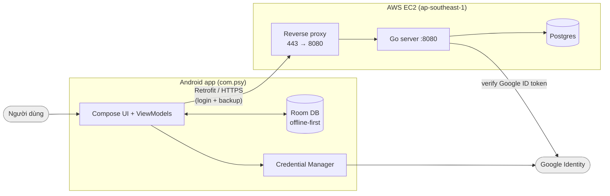
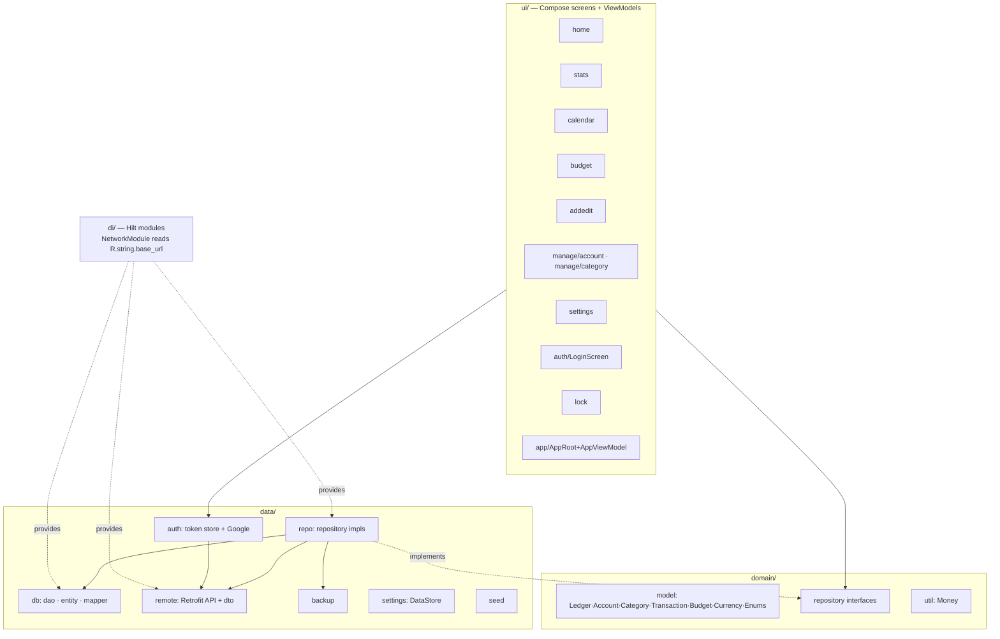
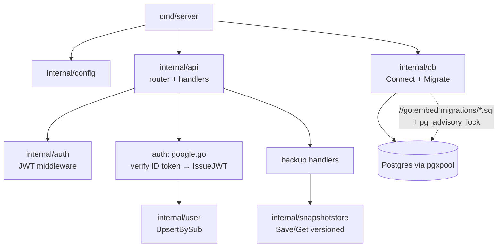
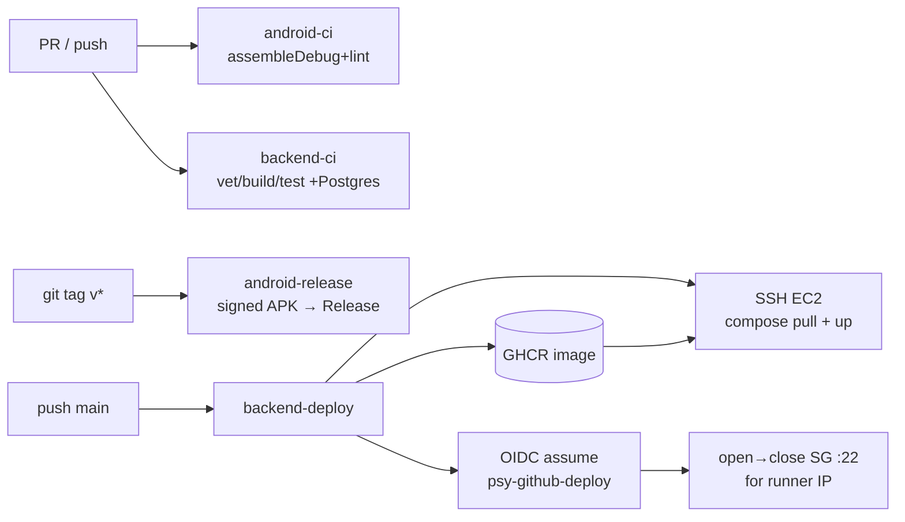
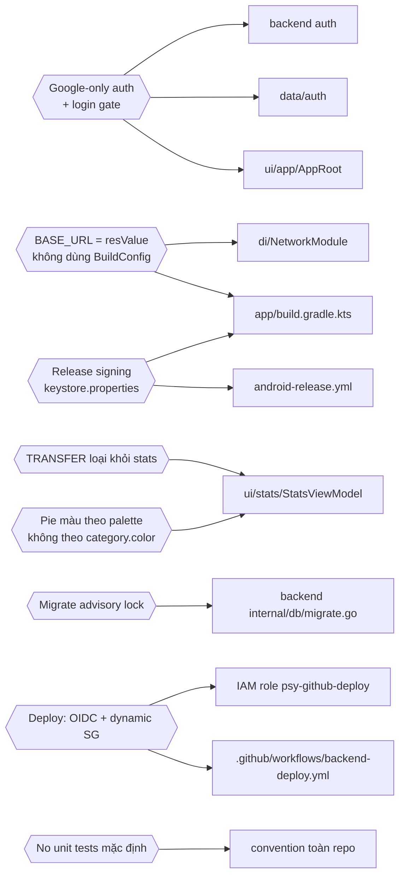

# Psy — Architecture & Knowledge Graph

Bản đồ hệ thống dạng sơ đồ, để session sau (hoặc người mới) nắm nhanh mà không cần đọc lại lịch sử. Tóm tắt + gotcha ở `../CLAUDE.md`; cách chạy ở `RUNNING.md`; CI/CD ở `CICD.md`; chi tiết từng feature ở `superpowers/specs/`.

## 1. System context

App **dùng được hoàn toàn offline** (Room). Backend chỉ phục vụ **đăng nhập Google** (bắt buộc khi mở app) và **sao lưu/đồng bộ snapshot**. TLS do reverse proxy trên EC2; server chỉ nghe HTTP :8080.

## 2. Android — layers (MVVM + Hilt)

ViewModel chỉ phụ thuộc **repository interfaces** (`domain/repository`); implementation ở `data/repo`. `NetworkModule` đọc base URL từ `R.string.base_url` (resValue), gắn Bearer token từ token store.

## 3. Domain data model (ER)

```mermaid
erDiagram
    LEDGER ||--o{ ACCOUNT : "có"
    LEDGER ||--o{ CATEGORY : "có"
    LEDGER ||--o{ TRANSACTION : "có"
    LEDGER ||--o{ BUDGET : "có"
    ACCOUNT ||--o{ TRANSACTION : "accountId"
    ACCOUNT ||--o{ TRANSACTION : "toAccountId (TRANSFER)"
    CATEGORY ||--o{ TRANSACTION : "categoryId"
    CATEGORY ||--o{ BUDGET : "giới hạn"

    TRANSACTION {
        long id
        enum type "INCOME|EXPENSE|TRANSFER"
        long amountMinor "số nguyên (minor units)"
        long accountId
        long toAccountId "chỉ TRANSFER"
        long categoryId "null cho TRANSFER"
        long date "epoch millis"
    }
    ACCOUNT {
        string name
        enum type "CASH|BANK|CREDIT|ASSET"
        string icon
        long color "ARGB"
    }
```

Tiền lưu bằng **minor units (Long)**, format bằng `Money.formatMinor` (số nguyên). Stats: **TRANSFER không tính** vào thu/chi.

## 4. Backend (Go)

`/auth/google` xác thực Google ID token → upsert user → cấp JWT (HS256). `/backup` (sau middleware JWT) lưu/đọc **snapshot** dữ liệu user (versioned). Migration nhúng, chạy lúc start, serialize bằng advisory lock.

## 5. CI/CD pipeline

Secrets: `ANDROID_KEYSTORE_*` (release signing), `AWS_DEPLOY_ROLE_ARN`, `EC2_HOST/USER/SSH_KEY`, `GHCR_TOKEN`. Xem `CICD.md`.

## 6. Knowledge graph — quyết định ↔ nơi áp dụng

## Mục cần đọc khi đụng vào…
| Việc | Đọc |
|---|---|
| Sửa 1 feature | `superpowers/specs/*-<feature>-design.md` |
| Chạy local | `RUNNING.md` |
| CI/CD, deploy, secrets | `CICD.md` |
| Gotcha nhanh + lệnh build | `../CLAUDE.md` |
